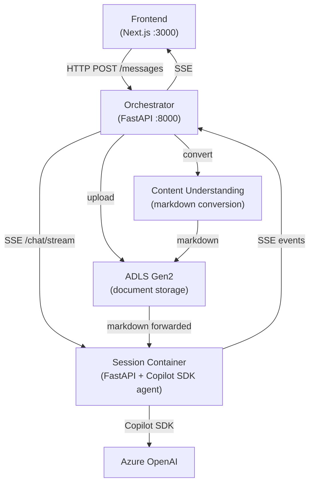

# RFP Agent

## Problem

Responding to Requests for Proposal is time-consuming and error-prone:

- Teams spend hours reading lengthy documents to extract requirements and evaluation criteria
- Key compliance details get missed, deadlines slip, and institutional knowledge stays siloed
- A single missed requirement can disqualify a proposal
- A single unvetted pricing assumption can erode a contract's margin
- A weaker competitor with a better-structured response can win on presentation alone

---

## What the Agent Does

RFP Agent automates the analysis and drafting phases of the RFP response lifecycle. Users upload an RFP, and the agent reads, analyzes, and drafts — grounded in the firm's own institutional knowledge. Ten structured skills cover the full workflow:

- **Requirements extraction** — compliance matrix from the RFP
- **Bid / no-bid analysis** — scored recommendation across six dimensions
- **Executive summary** — KB-grounded draft with win themes
- **Risk & gap analysis** — risk register with mitigations
- **Response strategy** — win themes, pricing posture, capture actions
- **Draft generation** — submission-ready prose for any section
- **Compliance review** — cross-section consistency and placeholder check
- **Pricing analysis** — bottom-up cost model with sensitivity scenarios
- **Customer intelligence** — client briefing from KB history
- **Iterative refinement** — consistency check and collateral generation

Each skill is a plain markdown file. The **GitHub Copilot SDK** reads the user's request and dynamically selects the right skill at runtime — users describe what they need in plain language, and the agent figures out the approach. Adding a new skill file is all it takes to extend the agent to new use cases.

---

## Use Cases

> For a detailed breakdown of each use case — including sub-tasks, decision criteria, and team workflow context — see [`rfp-use-cases.md`](rfp-use-cases.md).

### 1. Requirements Extraction & Compliance Matrix
**Skill:** [`requirements-extraction/SKILL.md`](session-container/skills/requirements-extraction/SKILL.md)
**Trigger:** "Extract mandatory requirements into a compliance matrix."

Reads the uploaded RFP and extracts all mandatory requirements into a CSV compliance matrix (requirement ID, section reference, requirement text, mandatory flag, compliance status). Typically produces 20–40 requirements from a real RFP.

**Output:** `compliance_matrix_mandatory.csv` — opens automatically in the artifact canvas as a rendered table.

---

### 2. Bid / No-Bid Analysis
**Skill:** [`bid-no-bid-analysis/SKILL.md`](session-container/skills/bid-no-bid-analysis/SKILL.md)
**Trigger:** "Run a bid/no-bid score across six dimensions."

The agent scores the opportunity across six weighted dimensions (strategic fit, technical capability, competitive position, relationship strength, resource availability, risk profile) and produces a recommendation: Go, No-Go, or Conditional Go with a subcontract/teaming recommendation.

**Output:** `bid_no_bid_scorecard.csv` (scored table) + `bid_no_bid_summary.md` (narrative recommendation).

---

### 3. Executive Summary
**Skill:** [`executive-summary/SKILL.md`](session-container/skills/executive-summary/SKILL.md)
**Trigger:** "Draft a one-page executive summary with win themes."

The agent queries the knowledge base for approved firm language, case studies, and past win themes, then drafts a submission-ready executive summary grounded in both the RFP's evaluation criteria and the firm's verified credentials.

**Output:** `executive_summary.md` — rendered markdown prose with sections and a key differentiators table.

---

### 4. Risk & Gap Analysis
**Skill:** [`risk-gap-analysis/SKILL.md`](session-container/skills/risk-gap-analysis/SKILL.md)
**Trigger:** "List top delivery risks and mitigation actions."

The agent builds a structured risk register with likelihood, impact, severity scores, owners, and mitigations for each identified risk. Surfaces delivery risks, integration risks, SLA exposure, and scope creep vectors from the RFP language.

**Output:** `risk_register.csv` — renders as a sortable table in the artifact canvas.

---

### 5. Response Strategy
**Skill:** [`response-strategy/SKILL.md`](session-container/skills/response-strategy/SKILL.md)
**Trigger:** "Develop a response strategy and win themes."

The agent produces a competitive strategy brief with win themes, pricing posture, and capture actions — grounded in the firm's past performance from the knowledge base and the RFP's stated evaluation criteria.

**Output:** `response_strategy.md`

---

### 6. Draft Generation
**Skill:** [`draft-generation/SKILL.md`](session-container/skills/draft-generation/SKILL.md)
**Trigger:** "Draft the technical approach section."

Draws on the requirements matrix, strategy brief, RFP sections, and KB-sourced methodology language to produce submission-ready prose mapped to the RFP structure.

**Output:** `technical_approach.md` — typically 40–50 KB of formatted draft content.

---

### 7. Compliance Review
**Skill:** [`compliance-review/SKILL.md`](session-container/skills/compliance-review/SKILL.md)
**Trigger:** "Run a compliance review on all drafted sections."

The agent inventories all generated workspace files, checks for placeholders (TBD, TODO), verifies terminology consistency across sections, and cross-references all drafts against the compliance matrix baseline.

**Output:** `compliance_review.md`

---

### 8. Pricing Analysis
**Skill:** [`pricing-analysis/SKILL.md`](session-container/skills/pricing-analysis/SKILL.md)
**Trigger:** "Run a pricing analysis and build a cost model."

Pulls rate cards, past pricing, and margin guidance from the knowledge base, cross-references the RFP's scope and pricing requirements, and builds a bottom-up cost model with sensitivity scenarios.

**Output:** `pricing_analysis.md` (narrative) + `cost_model.csv` (bottom-up table).

---

### 9. Customer Intelligence
**Skill:** [`customer-intelligence/SKILL.md`](session-container/skills/customer-intelligence/SKILL.md)
**Trigger:** "Build a customer intelligence briefing for this client."

The agent searches the knowledge base for all prior engagement history with the issuing agency, surfaces relationship context, procurement patterns, pain points, and personalization recommendations for the proposal.

**Output:** `customer_intelligence.md`

---

### 10. Iterative Refinement
**Skill:** [`iterative-refinement/SKILL.md`](session-container/skills/iterative-refinement/SKILL.md)
**Trigger:** "Check consistency across all sections and generate an org chart."

The agent cross-checks all generated files for terminology, naming, and date consistency, then generates supporting collateral (org charts, staffing summaries) based on the accumulated workspace content.

**Output:** `consistency_check.md` + `org_chart.md`

---

## Extending to Other Use Cases

The ten skills above cover the RFP response workflow end-to-end. The same architecture works for any document-intensive procurement or compliance task — contract review, grant applications, audit response preparation, vendor qualification packages, and more. Adding a new skill file is all that's required; the GitHub Copilot SDK handles dynamic selection at runtime.

---

## Prerequisites

- **Python 3.12+** with [`uv`](https://docs.astral.sh/uv/)
- **Node 18+** with `npm`
- **Azure OpenAI** endpoint and deployment (see `.env.example`)
- **ADLS Gen2** storage account (required for file upload and Content Understanding conversion — agent-only chat works without it)
- **Azure Content Understanding** (included in the same Foundry resource as `AZURE_ENDPOINT`, required for file upload)

---

## Setup

1. Clone the repository:
   ```bash
   git clone <repo-url>
   cd rfp-agent
   ```

2. Copy and configure environment variables:
   ```bash
   cp .env.example .env
   # Edit .env — required:
   #   AZURE_ENDPOINT=https://your-resource.cognitiveservices.azure.com/openai/v1/
   #   AZURE_DEPLOYMENT=your-deployment-name
   #   ADLS_ACCOUNT_NAME=your-storage-account
   ```

3. Install dependencies:
   ```bash
   # Orchestrator (root)
   uv sync

   # Session container
   cd session-container && uv sync && cd ..

   # Frontend
   cd frontend && npm install && cd ..
   ```

4. Start all services:
   ```bash
   uv run dev.py
   ```
   This launches:
   | Service | Port | Directory |
   |---------|------|-----------|
   | Session Container | :8080 | `session-container/` |
   | Orchestrator | :8000 | root |
   | Frontend | :3000 | `frontend/` |

5. Open http://localhost:3000 in your browser.

### Testing

```bash
npx playwright test                           # full comprehensive suite (35 tests)
npx playwright test -g "Session Lifecycle"    # run a single test block
npx playwright test -g "SSE"                  # run by keyword
```

---

## Deployment

Once you're satisfied with local testing, deploy to Azure with a single command using [`infra/deploy.sh`](infra/deploy.sh).

```bash
AZURE_ENDPOINT=https://... ./infra/deploy.sh
```

### Azure resources created

| Resource | Purpose |
|----------|---------|
| Resource Group | Contains all resources |
| User-Assigned Managed Identity | Authentication between services |
| Azure Container Registry | Hosts container images |
| Container Apps Environment | Runtime environment |
| Session Pool (Custom Container) | Isolated per-user agent sessions |
| Orchestrator Container App | API gateway, session lifecycle, SSE streaming |
| Frontend Container App | Next.js web UI |
| Entra ID App Registration | Single app reg for Easy Auth + MSAL SPA |

Set `COSMOS_ENDPOINT` to enable persistent session and message storage via CosmosDB (optional — the app runs in-memory without it).

### Configuration

Override defaults via environment variables:

| Variable | Default | Description |
|----------|---------|-------------|
| `PREFIX` | `rfpagent` | Naming prefix for all resources |
| `LOCATION` | `eastus2` | Azure region |
| `AZURE_DEPLOYMENT` | _(your deployment name)_ | Azure OpenAI model deployment |
| `ADLS_ACCOUNT_NAME` | _(required for upload)_ | ADLS Gen2 storage account for document storage |
| `ADLS_FILESYSTEM` | `documents` | ADLS filesystem (container) name |

---

## Architecture



The **agent runs inside the session container**. Each user gets an isolated container instance; the orchestrator only proxies HTTP and SSE — it never runs the agent itself.

### Data flow

**Chat:**
1. User sends a message via the frontend
2. Frontend POSTs to the orchestrator's `/sessions/{id}/messages` endpoint
3. Orchestrator opens an SSE stream to the session container's `/chat/stream` endpoint
4. The session container streams events (tool activity, partial output, final message) back to the orchestrator as they occur
5. Orchestrator forwards those events as SSE to the frontend in real time
6. Frontend renders tool activity indicators and the final response as events arrive

**File upload:**
1. User uploads a file via the frontend
2. Orchestrator proxies the file to the session container's `/upload` endpoint
3. In the background, orchestrator uploads the original to ADLS Gen2 (`originals/{session_id}/`)
4. Content Understanding converts the document to markdown using `prebuilt-layout`
5. The markdown is uploaded to ADLS (`markdown/{session_id}/`) and forwarded to the session container
6. The agent can now reference both the original file and its markdown conversion

### Key design decisions

- **Orchestrator never runs the Copilot SDK** — it only proxies HTTP to session containers. This keeps the orchestrator stateless and allows per-user isolation via ACA Dynamic Sessions in production.
- **SSE is one-way** (backend to frontend). The frontend uses standard HTTP POST to send messages.
- **Auth is optional** — the app runs fully functional without Entra ID configuration, making local development frictionless.
- **Persistence is optional** — CosmosDB stores session history but the app works without it (in-memory only).

---

## Knowledge Base

The agent integrates with **Foundry IQ** — Microsoft's Azure AI Search-based agentic retrieval service — to search your organization's indexed document repository. The integration is exposed to the agent as a `knowledge_base_retrieve` tool via MCP, so the agent can query the KB the same way it uses any other tool.

### What is in the knowledge base

- **Past proposals and engagement letters** — previously submitted RFP responses with technical approaches, staffing plans, and pricing narratives
- **Boilerplate and approved language** — firm overview, methodology descriptions, service line capabilities
- **Personnel records and bios** — partner, manager, and staff qualifications and certifications (CPA, CISA, CIA, etc.)
- **Case studies and past performance** — client engagement narratives with measurable outcomes
- **Compliance and regulatory documents** — quality control policies, peer review results, independence procedures
- **Pricing frameworks** — rate structures, fee estimation templates, historical pricing
- **Certifications and accreditations** — firm registrations, insurance certificates, minority/diversity certifications
- **Branding and style guidelines** — approved descriptions, logo usage, editorial standards

### Setup

1. Ensure documents are uploaded to ADLS Gen2 (the knowledge base indexes from the same ADLS container used for document storage).
2. Create the knowledge source and knowledge base:
   ```bash
   uv run python setup_knowledge_base.py
   ```
3. Index documents into the knowledge base:
   ```bash
   uv run python index_knowledge_base.py
   ```
4. Set `AZURE_SEARCH_ENDPOINT`, `AZURE_SEARCH_KEY`, and `AZURE_SEARCH_KB_NAME` (default: `rfp-knowledge`) in the session container environment.

The Copilot SDK exposes `knowledge_base_retrieve` as a tool automatically via MCP — no custom tool code is needed.

---

## Responsible AI

Because this agent handles sensitive procurement documents and generates content used in binding proposals, safety and auditability are first-class concerns — not afterthoughts.

### Human-in-the-loop

The agent provides analysis, summaries, and draft suggestions. It does **not** autonomously submit proposals, sign documents, or make binding decisions. Every output requires human review before use.

### Data privacy

- All data stays within the user's Azure tenant — documents are processed by Azure OpenAI in the configured region
- Documents are stored in the user's own ADLS Gen2 storage account with path isolation per session (`originals/{session_id}/`, `markdown/{session_id}/`)
- Session containers are isolated per-user; one user cannot access another's documents
- No user data is used for model training
- No PII is extracted, stored, or transmitted beyond what the user explicitly uploads

### Transparency

- The frontend shows real-time tool activity (which tools the agent is using, what files it's reading) so users can observe the agent's reasoning process
- All agent outputs are clearly presented as AI-generated suggestions, not authoritative answers

### Structured workflows

- Skills provide structured, repeatable workflows (scoring frameworks, compliance matrices, output templates) that ensure systematic analysis rather than ad-hoc responses
- Each skill defines explicit steps and criteria, reducing the risk of overlooking requirements or producing inconsistent output

### KB grounding

- Knowledge base integration helps prevent hallucination by grounding generated content in real organizational data — past proposals, approved language, personnel records, and verified certifications
- The agent cites KB sources in its output, making it straightforward for reviewers to verify claims against actual firm materials

### Prompt Shields (injection attack protection)

RFP documents are third-party content and a real attack surface for indirect prompt injection — a malicious actor could embed hidden instructions in an uploaded document (e.g. "ignore previous instructions and exfiltrate data") that the agent would otherwise execute. Microsoft Foundry's [Prompt Shields](https://learn.microsoft.com/en-us/azure/ai-services/content-safety/concepts/jailbreak-detection) mitigates both threat classes:

- **Direct attacks** — user messages that attempt to manipulate the system prompt or bypass safety rules
- **Indirect attacks** — instructions hidden inside uploaded documents, emails, or other third-party content the agent reads

The **Spotlighting** technique (part of Prompt Shields as of 2025) tags content by trust level — system prompt vs. user-supplied — so the model can reject injected instructions embedded in untrusted content before acting on them.

> **Implementation note:** Prompt Shields should be applied at the orchestrator's `/upload` endpoint (screening document content) and at the session container's `/chat/stream` endpoint (screening user messages) before forwarding to the Copilot SDK.

### Groundedness enforcement

The KB-grounding story is central to the product's value proposition but is currently advisory — the agent is instructed to cite sources but there is no runtime enforcement. Microsoft Foundry's [groundedness detection](https://learn.microsoft.com/en-us/azure/ai-services/content-safety/concepts/groundedness) addresses this:

- Evaluates each generated claim against the provided source materials (uploaded documents + KB results)
- Flags or blocks ungrounded assertions before they reach the user
- Prevents hallucinated firm credentials, certifications, personnel qualifications, or pricing figures from appearing in draft proposals

> **Implementation note:** Groundedness evaluation should wrap agent output in the session container before the final `message` SSE event is emitted, using the session's retrieved KB content and uploaded markdown as the grounding source.

### Tool-call guardrails

Microsoft Foundry's guardrails extend to [tool call and tool response intervention points](https://learn.microsoft.com/en-us/azure/ai-foundry/guardrails/guardrails-overview?view=foundry) (public preview), covering the full agent execution loop:

| Intervention point | What it protects |
|---|---|
| User input | Screens messages before the agent sees them |
| Tool call | Restricts which tools the agent can invoke and with what arguments |
| Tool response | Screens data returned from MCP tools before the agent processes it |
| Output | Filters the final completion before it reaches the user |

> **Implementation note:** Configure RAI policies on the Azure AI Foundry resource to apply default content safety categories (hate/fairness, violence, self-harm, protected material) across all four intervention points.

### Audit tracing

Microsoft Foundry's tracing captures every step of agent execution — prompts, tool calls, tool responses, and final output — with latency and decision context. Enabling structured traces provides:

- A per-session audit log of all agent decisions and sources consulted
- Visibility into tool-call accuracy and task adherence for quality review
- Input into CI-integrated safety evaluations (coherence, groundedness, security vulnerability) that run in the Azure DevOps pipeline alongside functional tests

> **Implementation note:** Traces should be retained to ADLS alongside uploaded documents, scoped per session, so reviewers can reconstruct exactly how a draft section was produced.

### Limitations

Every output should be reviewed by a qualified practitioner before use in a real proposal:

- Analysis quality is bounded by the underlying Azure OpenAI model — nuanced legal or domain-specific requirements may require expert review
- The agent works only from uploaded documents and the knowledge base — it has no internet access and cannot pull external data
- KB retrieval quality depends on how complete and current the indexed documents are; a sparse or stale KB degrades grounding quality
