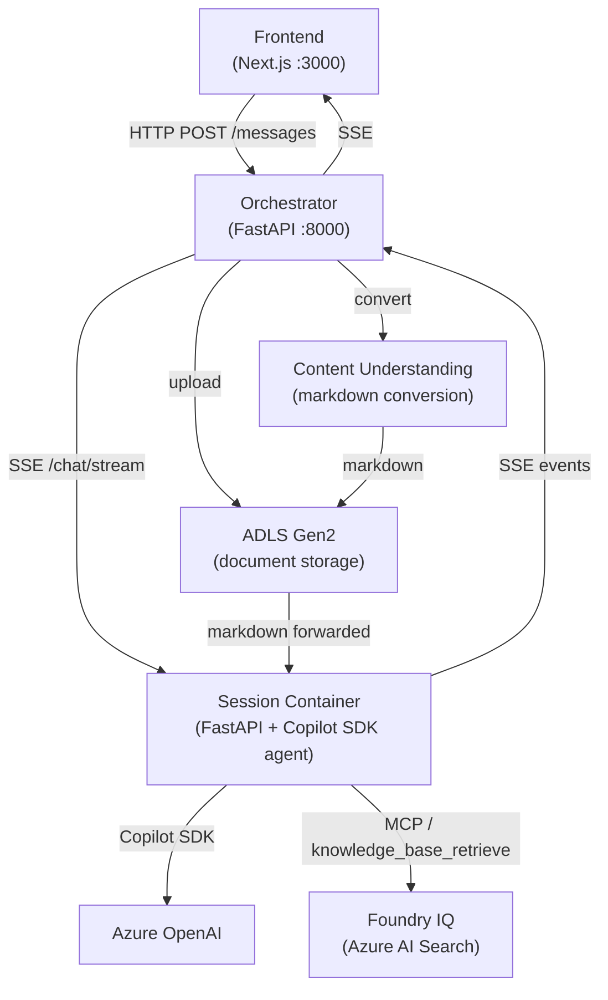

# RFP Agent — Presentation Deck

Place the final slide deck (`RFPAgent.pptx`) in this directory.

---

## Slide 1: Business Value Proposition

### The Problem

Professional services firms respond to dozens of RFPs per year. Each response costs **40–80 hours** of senior staff time:

- Requirements buried across hundreds of pages — manually extracted, easily missed
- Institutional knowledge (past proposals, pricing history, certifications) siloed in file shares
- No systematic process for bid/no-bid decisions, risk assessment, or compliance verification
- A single missed requirement disqualifies a bid. A single wrong pricing assumption kills the margin.

### The Solution

**RFP Agent** — an AI-powered proposal accelerator built on the **GitHub Copilot SDK** with 10 structured workflow skills and a Foundry IQ knowledge base. Users upload an RFP and talk to the agent in plain language. The SDK dynamically selects and executes the right workflow.

| Skill | What it produces |
|---|---|
| Requirements Extraction | Compliance matrix CSV (20–40 classified requirements) |
| Bid / No-Bid Analysis | Scorecard across 6 dimensions with Go/No-Go recommendation |
| Executive Summary | KB-grounded 1-page summary with win themes |
| Risk & Gap Analysis | Risk register with severity scores and mitigations |
| Response Strategy | Win themes, competitive positioning, pricing approach |
| Draft Generation | Submission-ready prose for any section |
| Compliance Review | Pre-submission pass/fail checklist with sign-off tracker |
| Pricing Analysis | Bottom-up cost model + sensitivity scenarios |
| Customer Intelligence | Client briefing with relationship history and recommendations |
| Iterative Refinement | Cross-section consistency check + collateral generation |

### Business Value

- **60–70% reduction** in time-to-first-draft through automated extraction and KB-grounded drafting
- **Improved compliance coverage** via systematic requirement tracking and pre-submission review
- **Institutionalized knowledge** — every response draws from the firm's indexed repository of past proposals, approved language, certifications, and case studies
- **Extensible** — the skill-file architecture adapts to any document-intensive procurement workflow (contracts, grants, audits, vendor qualification) with no code changes

---

## Slide 2: Technical Architecture

### Architecture

### Azure & Microsoft Integration

| Service | Role |
|---|---|
| **GitHub Copilot SDK** | Agent framework — session management, skill loading, tool execution, SSE streaming |
| **Azure OpenAI** | Model backend for all agent reasoning |
| **Azure Container Apps** | Hosts orchestrator and frontend |
| **ACA Dynamic Sessions** | Per-user isolated containers — one agent instance per user, full filesystem isolation |
| **ADLS Gen2** | Document storage with per-session path isolation |
| **Azure Content Understanding** | Converts uploaded PDFs and Office docs to structured markdown via `prebuilt-layout` |
| **Foundry IQ (Azure AI Search)** | Agentic retrieval over indexed organizational knowledge via MCP |
| **Azure Container Registry** | Hosts all container images |
| **Entra ID** | Optional Easy Auth for enterprise SSO |
| **CosmosDB** | Optional persistent session and message history |

### Key Design Decisions

- **Orchestrator never runs the Copilot SDK** — stateless proxy only; all agent logic lives in isolated session containers
- **Skills as plain markdown** — zero code required to add new workflows; the SDK loads and applies them automatically
- **Foundry IQ via MCP** — knowledge base exposed as a native tool; the agent queries it the same way it uses bash or grep
- **Single-command deployment** — `infra/deploy.sh` provisions all Azure resources end-to-end

### Responsible AI

- **Human-in-the-loop** — agent drafts and analyzes; never submits, signs, or makes binding decisions
- **Per-user data isolation** — ADLS paths scoped per session; containers isolated per user
- **Prompt Shields** — indirect injection protection for third-party RFP document content
- **Groundedness enforcement** — KB citations in every output; Foundry IQ grounding prevents hallucinated credentials
- **Audit tracing** — per-session execution logs retained to ADLS

### GitHub Repo

[github.com/your-org/rfp-agent](https://github.com/your-org/rfp-agent)

---

## 150-Word Project Summary

> RFP Agent is an AI-powered proposal response accelerator built on the GitHub Copilot SDK. Professional services firms upload an RFP document and interact with an agent that dynamically executes 10 structured workflow skills — from bid/no-bid scoring and requirements extraction to draft generation and compliance review. The agent is grounded in the firm's own institutional knowledge via Foundry IQ (Azure AI Search agentic retrieval), queried through MCP, drawing on indexed past proposals, personnel records, pricing frameworks, and certifications to produce evidence-backed outputs.
>
> Built on a three-tier Azure architecture (Next.js frontend, FastAPI orchestrator, Copilot SDK session containers via ACA Dynamic Sessions), it deploys with a single command and integrates ADLS Gen2, Azure Content Understanding, Entra ID, and CosmosDB. Skills are plain markdown files — adding a new workflow requires no code. The architecture extends beyond RFPs to any document-intensive procurement or compliance use case.
